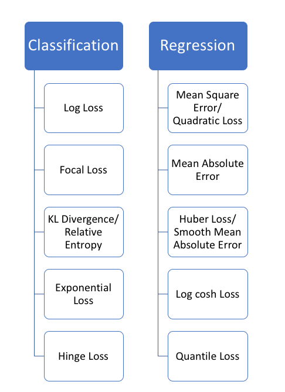
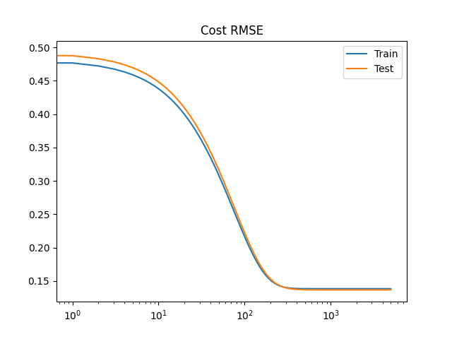
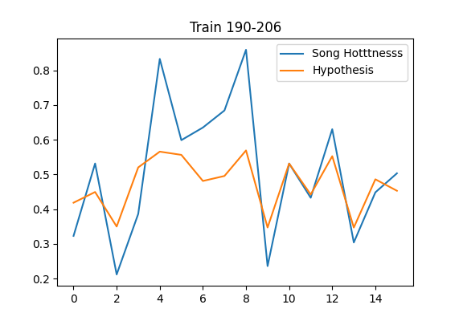
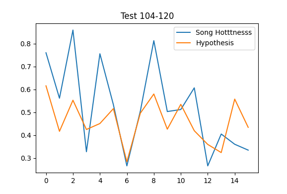

# Regression  Project

This project aims to predict **hotttnesss of a song**. It  is a decimal score, between zero and one, based on `The Echo Nest data` from 2010. It is limited by the subset provided by millionsongdataset. By simplicity, it was only considered the songs attributes of all the information. The major groups are metadata, analysis, and musicbrainz

## Table of contents
* [Table of contents](#table-of-contents)
* [Installation](#installation)
* [Dataset description](#dataset-description)
  * [Analysis Group](#analysis-group)
  * [Metadata Group](#metadata-group)
  * [Musicbrainz Group](#musicbrainz-group)
* [Linear regression](#linear-regression)
  * [Model](#model)
  * [Cost Function](#cost-function)
  * [Results](#results)
    * [Result Group 0](#result-group-0)
    * [Result Group 1](#result-group-1)
    * [Result Group 2](#result-group-2)
* [References](#references)
* [Extra](#extra)
  * [Useful commands](#useful-commands)
  * [Implementation process](#implementation-process)


## Installation
Setup your project folders and files

```bash
chmod +x install.sh
./install.sh
```

[⬆️ Return](#table-of-contents)

## Dataset description

Dataset of 10k songs, random by MSD. It has three groups: metadata, analysis, musicbrainz

### Metadata Group
Metadata group with 20 attributes
```python
dtype([
    ('analyzer_version', 'S32'),        #0
    ('artist_7digitalid', '<i4'),       #1
    ('artist_familiarity', '<f8'),      #2 - Yes
    ('artist_hotttnesss', '<f8'),       #3 - Yes
    ('artist_id', 'S32'),               #4
    ('artist_latitude', '<f8'),         #5
    ('artist_location', 'S1024'),       #6
    ('artist_longitude', '<f8'),        #7
    ('artist_mbid', 'S40'),             #8
    ('artist_name', 'S1024'),           #9
    ('artist_playmeid', '<i4'),         #10
    ('genre', 'S1024'),                 #11 - Maybe
    ('idx_artist_terms', '<i4'),        #12
    ('idx_similar_artists', '<i4'),     #13
    ('release', 'S1024'),               #14
    ('release_7digitalid', '<i4'),      #15
    ('song_hotttnesss', '<f8'),         #16 - Target - Can be a NaN | Filter
    ('song_id', 'S32'),                 #17
    ('title', 'S1024'),                 #18
    ('track_7digitalid', '<i4')         #19
])
```
[⬆️ Return](#table-of-contents)

### Analysis Group
Analysis group with 31 attributes
```python
dtype([
    ('analysis_sample_rate', '<i4'),            #0
    ('audio_md5', 'S32'),                       #1
    ('danceability', '<f8'),                    #2 - X Empty [0, 1]
    ('duration', '<f8'),                        #3 - Yes
    ('end_of_fade_in', '<f8'),                  #4 - Yes
    ('energy', '<f8'),                          #5 - X Empty [0, 1]
    ('idx_bars_confidence', '<i4'),             #6 - X Empty
    ('idx_bars_start', '<i4'),                  #7 - X Empty
    ('idx_beats_confidence', '<i4'),            #8 - X Empty
    ('idx_beats_start', '<i4'),                 #9 - X Empty
    ('idx_sections_confidence', '<i4'),         #10 - X Empty
    ('idx_sections_start', '<i4'),              #11 - X Empty
    ('idx_segments_confidence', '<i4'),         #12 - X Empty
    ('idx_segments_loudness_max', '<i4'),       #13 - X Empty
    ('idx_segments_loudness_max_time', '<i4'),  #14 - X Empty
    ('idx_segments_loudness_start', '<i4'),     #15 - X Empty
    ('idx_segments_pitches', '<i4'),            #16 - X Empty
    ('idx_segments_start', '<i4'),              #17 - X Empty
    ('idx_segments_timbre', '<i4'),             #18 - X Empty
    ('idx_tatums_confidence', '<i4'),           #19 - X Empty
    ('idx_tatums_start', '<i4'),                #20 - X Empty
    ('key', '<i4'),                             #21
    ('key_confidence', '<f8'),                  #22
    ('loudness', '<f8'),                        #23
    ('mode', '<i4'),                            #24
    ('mode_confidence', '<f8'),                 #25
    ('start_of_fade_out', '<f8'),               #26
    ('tempo', '<f8'),                           #27
    ('time_signature', '<i4'),                  #28
    ('time_signature_confidence', '<f8'),       #29
    ('track_id', 'S32')                         #30
])
```

[⬆️ Return](#table-of-contents)
### Musicbrainz Group
```python
dtype([
    ('idx_artist_mbtags', '<i4'),   #0
    ('year', '<i4')                 #1
])
```

Some values are undefined, before the training part, there was a validation process to verify non-nullable or missing values. The 10k records downloaded from MSD, are not provided with danceability and energy. In consequence, the model will be missing important attributes.

[⬆️ Return](#table-of-contents)
## Linear regression

The model implemented is linear regression. A numeric score should be the result of the model, therefore it is a regression problem. It is limited to attributes that could not be related to the real calc of the measure.


### Model


### Cost Function
[](https://heartbeat.fritz.ai/5-regression-loss-functions-all-machine-learners-should-know-4fb140e9d4b0)

It will help us to measure the behavior of the model, in other words, what is the loss. As in an article mentioned in the references, the loss(not the same as cost) function describes the form of the error, and the descent will be the downside process. For gradient descent, the loss function should be derivable.

[](https://heartbeat.fritz.ai/5-regression-loss-functions-all-machine-learners-should-know-4fb140e9d4b0)


The chosen cost function to measure our model is RMSE. It is because a linear relation of units will facilitate the analysis, outliers could affect it. **Important** this function is only for analysis purposes and not for improving the model.


-------------

The cost function to train the model


The purpose is minimize the error between the prediction, so the model needs to move down towards the function. For that, it can be derivated, this value means how much our descent should move, it will be also affected by the learning rate.


It will be removed to the previous param value


[⬆️ Return](#table-of-contents)

### Results

#### Result Group 0

Using 14 attributes(including bias), with a learning rate of 10, it diverges. Parameters oscillate between positive and negative values, but they can not converge

[](https://asciinema.org/a/GMkg4hLF29ZpCEEFJvMMrJ0cW)


We can get better results with a lower learning rate of 0.01

[](https://asciinema.org/a/Ml9dJZwIKHalvsGOjlinwXqnn)

[⬆️ Return](#table-of-contents)

#### Result Group 1

With 5000 epochs, looking for less than 0.01 with a learning rate of 0.1; Train size 2950, Test size 1264





```python
# Final Parameters
Bias = 4.5689969077910070e-01
audio_md5 = 5.4573519380770839e-03
year = 3.4212693288237568e-02
loudness = 1.3203266354525294e-02
mode = -4.3669295455111487e-03
tempo = 2.6598180921980005e-03
time_signature = 4.1232899012358566e-04
artist_familiarity = 4.6258212788267319e-02
artist_hotttnesss = 3.4633849986531004e-02
```

After applying the model with output parameters

```
Samples from 562 to 572
    hyp 0.26586104921065007 y 0.401203522922599
    hyp 0.4137398358601097 y 0.5684640847172688
    hyp 0.2416552517044926 y 0.6336199597135092
    hyp 0.3552855364230894 y 0.435398565057618
    hyp 0.52549711888017 y 0.43113513759439415
    hyp 0.6582414367557253 y 0.5033091661911661
    hyp 0.4176416475968032 y 0.4514920652295682
    hyp 0.541551997892655 y 0.39091498285641035
    hyp 0.46384907791765656 y 0.404715590122965
    hyp 0.5616924111789523 y 0.5144792508848043
```

The previous results demonstrate that the variance is significant, but it still keeps in the expected range

### Result Group 2

The previous model was tested with multiple epoch values, but the result with higher values does not have a relevant improvement. A fixed learning rate gives a problem if it is bigger than 2. To improve it, a dynamic learning rate can be implemented.

[⬆️ Return](#table-of-contents)
## References
* https://github.com/mdeff/fma
* http://millionsongdataset.com/musixmatch/
* http://millionsongdataset.com/pages/field-list/
* https://medium.com/atchai/in-search-of-the-perfect-music-dataset-ed7e111d3b7e
* https://heartbeat.fritz.ai/5-regression-loss-functions-all-machine-learners-should-know-4fb140e9d4b0
* https://towardsdatascience.com/difference-between-batch-gradient-descent-and-stochastic-gradient-descent-1187f1291aa1
* https://towardsdatascience.com/batch-mini-batch-stochastic-gradient-descent-7a62ecba642a
* https://www.dataquest.io/blog/understanding-regression-error-metrics/


Thierry Bertin-Mahieux, Daniel P.W. Ellis, Brian Whitman, and Paul Lamere. 
The Million Song Dataset. In Proceedings of the 12th International Society
for Music Information Retrieval Conference (ISMIR 2011), 2011.

[⬆️ Return](#table-of-contents)

## Extra

### Useful commands
```bash
#/mnt/d/tmp_ml/msd/MillionSongSubset/data
find . -type f -name \*.h5 -exec cp \{\} /mnt/d/tmp_ml/msd/MillionSongSubset/tracks/ \;

# find . -type f -name \*.txt -exec cp \{\} /home/jupyter/xseed-test/data/domains \;
# ls | xargs -I{ cat { > /home/jupyter/xseed-test/data/domains.txt
```
[⬆️ Return](#table-of-contents)

### Implementation process

* Look for music datasets
* Understand datasets
* Define the scope for regression algorithm
* Implement model
* Write documentation

[⬆️ Return](#table-of-contents)
